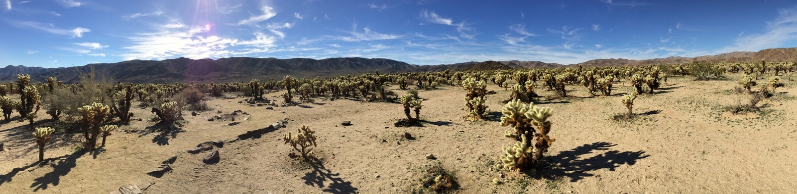

---
# Feel free to add content and custom Front Matter to this file.
# To modify the layout, see https://jekyllrb.com/docs/themes/#overriding-theme-defaults

layout: home
---

_Teddybear Cholla cacti, Cactus Garden, Joshua Tree National Park, California._

## EEB 2245/2245W (Evolution)

**Important Notice:** This web site is now **obsolete**. It was used for the Spring 2019 version of the course. The Fall 2019 course website is in [HuskyCT](https://huskyct.uconn.edu).

This is a course in the [Department of Ecology and Evolutionary Biology](https://www.eeb.uconn.edu/) at the [University of Connecticut](https://uconn.edu/). The primary goal of the course is to teach the basic principles of evolutionary biology and the history of life on earth. 

Below you will find basic information about the course. Visit the menu items at the top for more information.

> **Meeting Time** 

Tuesdays and Thursdays, 9:30-10:45 am in TLS 154.

> **Textbook**

Futuyma, D. J., and M. Kirkpatrick. _Evolution_. 4th ed. Sinauer Associates/Oxford University Press ([ISBN 978-1-60535-605-1](https://global.oup.com/ushe/product/evolution-9781605356051?lang=en&cc=us)).

> **Assigned readings and activities**

Indicated on the [lecture schedule](lecture-schedule). Please read the assigned material before coming to class.

> **W section**

This web site contains information for the _lecture_ component of the course only. Please see [Grading](grading) for information related to the W portion of the course (only relevant for those enrolled in EEB-2245W).
